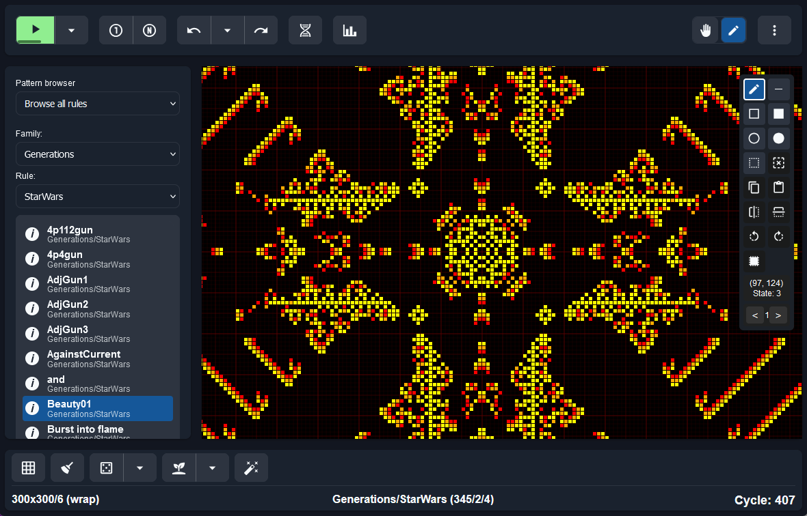

# MCell, Mirek's Cellebration

[](https://opensource.org/licenses/MIT)
[](https://www.typescriptlang.org/)
[](https://mcell.ca)
[](https://github.com/MiDevel/mcell-webapp)
[](https://github.com/MiDevel/mcell-webapp/commits/main)
[](https://github.com/MiDevel/mcell-webapp/blob/main/CONTRIBUTING.md)
[](https://github.com/MiDevel/mcell-webapp/commits/main)
[](https://github.com/MiDevel/mcell-webapp/issues)
[](https://github.com/MiDevel/mcell-webapp/stargazers)
[](https://github.com/MiDevel/mcell-webapp)

A web-based Cellular Automata explorer allowing to view, animate, create and study hundreds of Cellular Automata rules and patterns from many classic and custom Cellular Automata families.

Author: Mirek Wojtowicz  
Website: https://mcell.ca  
Contact: info@mcell.ca  
Github: https://github.com/MiDevel/mcell-webapp




# Table of Contents

* [Features](#features)
* [Development](#development)
* [Deployment](#deployment)
* [Contributing](#contributing)
* [Acknowledgments](#acknowledgments)
* [Roadmap](#roadmap)
* [License](#license)


# Features

* 1-D and 2-D Cellular Automata.
* 13 different CA families: Life, Generations, Weighted Life, Vote for Life, Rules tables, Cyclic CA, 1-D totalistic CA, 1-D binary CA, General binary, Neumann binary, Larger than Life, Margolus, Weighted Generations
* Support for different neighborhoods: Moore 8 and 9, von Neumann 4 and 5, Margolus, neighborhood ranges.
* Support for many different file formats: Life 1.03, Life 1.05, Life 1.06, RLE, dbLife, Xlife, MCell and variations of the above. 
* Many predefined rules for each family.
* 1500+ patterns.
* Rich user interface, built-in Patterns Explorer, zooming, panning, auto-fitting patterns, keyboard shortcuts to many MCell functions.
* Support for up to 256 states/colors of cells.
* Configurable simulation speed, step-by-step simulation, run for/up to a specified number of generations.
* Ability to experiment with custom rules in all supported families (only as text definition a.t.m.).
* Saving and loading patterns via Clipboard.
* Drag-and-drop support for loading patterns.
* Advanced editing features: scribble; draw dots, lines, rectangles, boxes, circles, discs; select, cut, copy, paste, drag and drop, flip, rotate, invert.
* Interactively draw without pausing the simulation.
* Randomizing and Seeding patterns.
* Configurable, event-driven Undo and Redo.
* Simple statistics.
* Dark and light themes.


# Development

## install dependencies
```bash
npm install
```

## build the TypeScript files
```bash
npm run build
```

## start the web server and watch for changes
```bash
npm run dev
```

## start the web server
```bash
npm run start
```

## watch the TypeScript files
```bash
npm run watch
```

## lint the TypeScript files
```bash
npm run lint
```

## format the TypeScript files
```bash
npm run format
```

# Deployment

To prepare files for deployment to a web server:

1. Ensure all your changes are committed and TypeScript files are properly typed.

2. Run the deployment script:
   ```bash
   npm run deploy
   ```

This will:
- Build the TypeScript files
- Clean any existing deployment directory
- Create a fresh `deploy` directory containing:
  - `index.html`
  - `favicon.ico`
  - `assets/` directory
  - `data/` directory
  - `dist/` directory (compiled TypeScript)
  - `styles/` directory

The contents of the `deploy` directory will be ready to upload to your web hosting server.


# Contributing

See [CONTRIBUTING.md](CONTRIBUTING.md)


# Roadmap

See [ROADMAP.md](ROADMAP.md)


# Acknowledgments

I would like to express my sincere gratitude to the many individuals who have contributed to making MCell possible.

- Prof. David Griffeath, The Primordial Soup Kitchen author, for comments, encouragement and the "MCell" (Mirek's Cellebration) name idea.

- Stephen Wolfram, for kind mentioning MCell and its author in the book "A New Kind of Science".

- Prof. Rudy Rucker, author of CelLab (https://www.fourmilab.ch/cellab/), for his invaluable contributions to the field of Cellular Automata and his comments and suggestions.

- Johan Bontes, author of Life32, for insights into Cellular Automata coding.

- James Matthews, webmaster for Generation5.org, for his helpful comments, reviews and suggestions.

- John Elliott, author of Webside CA Java applet, for endless discussions and invaluable suggestions.

- Michael Sweney and Lionel Bonnetier, authors of many "Generations" rules and patterns.

- Dr Dana Eckart, Paul Callahan, Alan Hensel, Ken S. Mueller, Ed Pegg Jr, David Ingalls Bell (https://members.canb.auug.org.au/~dbell/), for words of encouragement and suggestions.

- Ben Schaeffer, author of LifeMN and many Weighted Life rules.

- Stephen Silver, author of Life Lexicon and of many StarWars rule patterns.

- Prof. Tomoaki Suzudo, author of CA applets and many Neumann binary rules and patterns.

- Jason Summers, author of Life patterns, for many Life and Weighted Life patterns.

- Jason Rampe, author of "Visions Of Chaos" and "Tiled CA", for many unique patterns in various rules.

- Brian Prentice, for many interesting patterns in several rules.

- And many others...


This list represents just a few of the many individuals who have contributed to the project. Thank you, guys!


# License

See [MIT License with Attribution Requirement](LICENSE)
